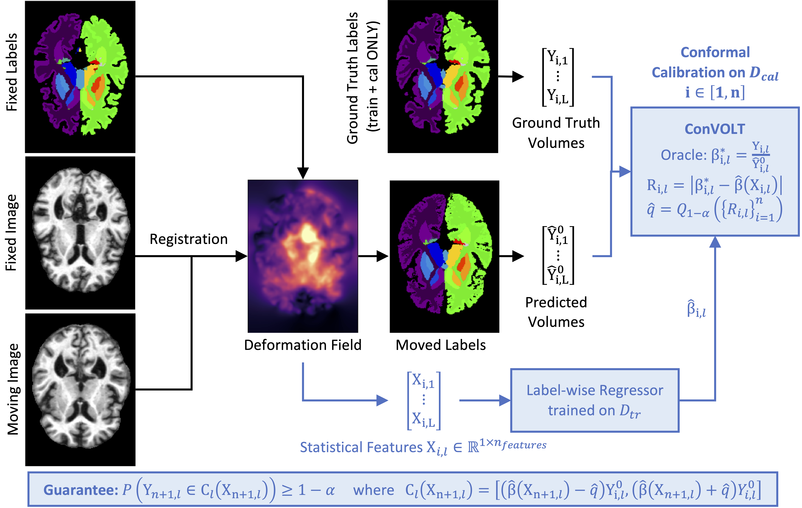

# Efficient Conformal Volumetry for Template-Based-Segmentation

#### Citation
```
@article{cheung2026efficient,
  title={Efficient Conformal Volumetry for Template-Based Segmentation},
  author={Cheung, Matt Y and Veeraraghavan, Ashok and Balakrishnan, Guha},
  journal={arXiv preprint arXiv:2603.00798},
  year={2026}
}
```



This repo runs 3D deformable image registration (multiple backends) and quantifies uncertainty on downstream volume metrics using split conformal prediction baselines, conformalized quantile regression (CQR), and **ConVOLT** (scale-CP).

**Code layout**
- Python package: `reg/`
- Repro scripts: `scripts/`
- Generated outputs (not versioned): `${CONVOLT_UQ_ROOT:-uq_results}/`

Step-by-step docs live under `docs/` (start with `docs/quickstart.md`).

## Dataset layout
Expected on disk (your example):
```
${CONVOLT_DATA_ROOT:-/scratch/yc130/Registration}/NLST/
  imagesTr/
  masksTr/
  keypointsTr/
  NLST_dataset.json
```

## Adding a new dataset

This repo currently has dataset-specific presets for `nlst`, `lungct`, `acdc`, and `oasis`. To add your own dataset:

1) Put your dataset under `${CONVOLT_DATA_ROOT}` (recommended) or pass `--dataset_dir /path/to/DATASET` when running `python -m reg register ...`.
2) Ensure it matches one of the supported on-disk schemas:
   - **Intra-patient paired registration (NLST/LungCT-style)**: nnUNet-like folders (e.g. `imagesTr/`, `masksTr/`) plus a single `*_dataset.json` containing paired entries (see `reg/dataset.py:load_pairs` for the expected keys).
   - **Inter-patient atlas segmentation (Learn2Reg-style)**: nnUNet-like `imagesTr/`, `labelsTr/`, `imagesTs/` plus `*_dataset.json` (see `reg/learn2reg_dataset.py`).
3) Register the dataset name in the code:
   - Add it to the `--dataset` `choices=[...]` lists in `reg/cli_unified.py` and `reg/uq/cli.py`.
   - Add a mapping in `reg/paths.py:default_dataset_dir` (so defaults work with `CONVOLT_DATA_ROOT`).
   - If your dataset needs custom loading or targets, add a small loader (e.g. `reg/my_dataset.py`) and call it from `reg/cli_unified.py` (similar to ACDC).
4) Make sure your registration run writes the standard outputs (`summary.csv` and `pairs/*/artifacts.npz`) under a new `results_dir` so UQ can load features (see `docs/registration.md`).

### Running a new dataset
After implementing the dataset hook-up above, run:
```bash
# Registration
python -m reg register --dataset <name> --method demons --split training

# UQ (global + optional regional guarantees)
python -m reg.uq.cli --dataset <name> --method demons --alpha 0.1 --n_repeats 50
```
If you added radial-shell regional guarantees (lung-like masks), include:
```bash
python -m reg.uq.cli --dataset <name> --method demons --alpha 0.1 --n_repeats 50 --region_defs radial --radial_shells 5 --region_scores q90,max,mean
```

## Install
```bash
python -m venv .venv && source .venv/bin/activate
pip install -r requirements.txt
```

Optionally install this project as a package (recommended if you want the `convolt-*` CLI commands):
```bash
pip install -e .
```

## Configure paths (recommended)

If you do not set any paths, defaults fall back to the original author’s environment under `/scratch/yc130/...`. For portability, set:
```bash
export CONVOLT_DATA_ROOT=/path/to/Registration
export CONVOLT_RESULTS_ROOT=/path/to/Registration/outputs
export CONVOLT_UQ_ROOT=/path/to/convolt/uq_results
```

## Standard output dirs (no manual paths)
Registration results are saved to:
- `${CONVOLT_RESULTS_ROOT}/{dataset}_{method}` (intra-patient datasets)
- `${CONVOLT_RESULTS_ROOT}/{dataset}_{method}_{atlas_tag}` (Learn2Reg inter-patient datasets)

UQ results are saved to:
- `${CONVOLT_UQ_ROOT}/{dataset}_{method}` or `${CONVOLT_UQ_ROOT}/{dataset}_{method}_{atlas_tag}`

## Registration (unified CLI)
Run from repo root:
```bash
python -m reg register --dataset nlst --method demons --split training
python -m reg register --dataset nlst --method voxelmorph --split training --vm_device cuda --vm_train_epochs 50
```

Other methods: `sitk_diffeomorphic_demons`, `sitk_bspline`, `itk_elastix_bspline`.

## Outputs
Each `results_dir` contains:
- `summary.csv` (+ `label_volumes.csv` for Learn2Reg inter-patient training)
- `summary_unlabeled.csv` for unlabeled Learn2Reg `--split test`
- `figures/*.png`
- `pairs/*/artifacts.npz` (Jacobian/disp fields + masks for UQ feature extraction)

## Notes
- Masks are treated as **lung = mask > 0**.
- `0000/0001` may not match inhale/exhale in all datasets; by default this code labels **inhale** as the scan with the **larger lung mask volume** (`--phase_policy mask_volume`).
- NIfTI reading is implemented without nibabel to keep dependencies minimal; if you have nibabel installed, you can easily swap it in later.

## UQ (unified CLI)
After registration (creates `summary.csv` + `pairs/*/artifacts.npz`), run:
```bash
python -m reg.uq.cli --dataset nlst --method demons --alpha 0.1 --n_repeats 100 --region_defs radial --radial_shells 5
python -m reg.uq.cli --dataset acdc --method voxelmorph --alpha 0.1 --n_repeats 50
```

Learn2Reg inter-patient datasets (atlas-based segmentation via registration) default to UQ on:
- union volume, plus
- top-K labels by mean GT volume (set with `--uq_topk_labels`, or override with `--uq_label_list`)

## Learn2Reg inter-patient datasets (atlas-based segmentation)
Datasets expected at:
- `${CONVOLT_DATA_ROOT:-/scratch/yc130/Registration}/OASIS`

Example (multi-atlas, 5 atlases):
```bash
python -m reg register --dataset oasis --method demons --split training --atlas_mode multi --atlas_n 5
python -m reg.uq.cli --dataset oasis --method demons --alpha 0.1 --n_repeats 30
```

For unlabeled test sets:
```bash
python -m reg register --dataset oasis --method demons --split test --atlas_mode multi --atlas_n 5
```

VoxelMorph training modes (Learn2Reg):
- `--vm_train_mode unsupervised|supervised|hybrid` (default: unsupervised)
- `--vm_train_cases N` (how many labeled subjects to train on; atlas IDs are excluded)

## Reproduce tables/figures

```bash
sh scripts/run_registration_all.sh
sh scripts/run_uq_all_outputs.sh
python scripts/combine_uq_tables.py --uq_root "${CONVOLT_UQ_ROOT:-uq_results}" --out_dir uq_results/_tables
python scripts/make_paper_figures.py --datasets lungct,nlst,oasis --backends demons,voxelmorph
```
